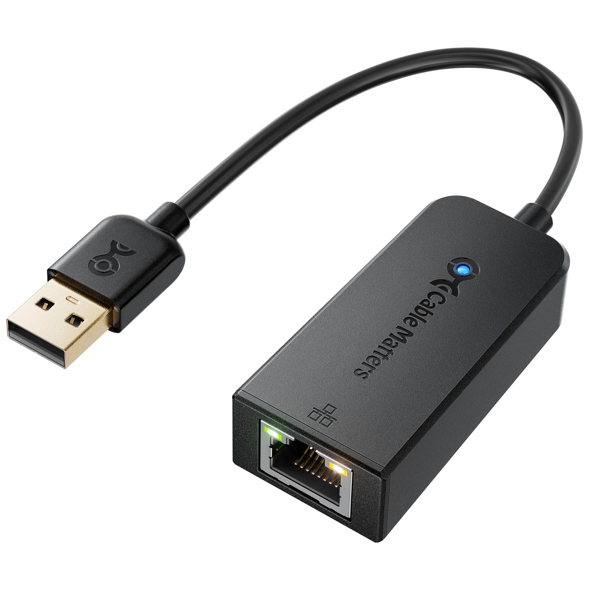

# Présentation de l'enseignant

##### Études
- Technique en informatique de gestion, Cegép André-Laurendeau
- B.Sc.A  en informatique et génie logiciel, UQAM 
##### Expérience professionnelle
- 10+ années d'expérience en entreprise
	- Développement du firmware et d'applications pour des Media Gateway (équipement utilisé dans le contexte de la téléphonie IP)
	- Programmation haute performance pour une plateforme de HFT
	- Contrôle de caméra pour plateforme de reconnaissance faciale par IA
- Près de 5 ans d'expérience en enseignement
	- Introduction aux ordinateurs
	- Réseau
	- Objets connectés
	- Sécurité des infrastructures
	- Systèmes d'exploitation
	- Programmation concurrente et distribuée

##### Intérêts
- Algorithmes et structures de données "lock-free"
- Programmation de services réseaux
- Électronique
- Soudure et le travail du métal
- Le métal (la musique)
- Le cinéma d'horreur
- Warhammer 40k
# Présentation du cours

#### Lecture du plan de cours 

#### Les plateformes utilisées pendant le cours
- [Github pour les notes de cours](https://github.com/gcourtemancheCAL/420-216-Reseau/tree/main)
- Moodle
	- Lien vers les notes de cours
	- Exercices, quiz formatifs et sommatifs
	- Programmation des évènements
- Teams
	- Programmation des cours au calendrier Outlook
	- **Aucune garantie d'exactitude**
- Mio
	- Communications

#### Obsidian
J'utilises [Obsidian](https://obsidian.md/download) pour visualiser et modifier les notes de cours. Vous êtes libre de le télécharger et de l'installer mais je ne vais pas offrir du support à cet effet en classe.

#### Github
Les notes de cours sont dans un repo sur github. Vous pouvez les consulter en ligne ou bien, aussi, cloner le repo et les avoir disponible localement sur votre système. 

Si vous cloner le repo, vous devrez vous assurer de le mettre à jour vous-même. Aucun support git ne sera offert pendant les heures de cours.

## Important! Reprises pour les travaux pratiques
Compte tenu des contraintes logistiques importantes reliées à la réalisation des laboratoires et des TPs, **AUCUNE** reprise ne sera possible.

## Important! Prise Ethernet
Il est nécessaire à la réalisation de plusieurs activités en classe que votre ordinateur portable dispose d'un port Ethernet.

![[img/Pasted image 20260113132730.png]]

Si votre ordinateur n'en dispose pas, vous devrez acheter un adaptateur compatible avec votre système. Cet adaptateur sera nécessaire à partir de la semaine prochaine et il est de votre responsabilité de toujours l'ammener en classe. 

**Nous n'avons pas d'adaptateur à vous fournir.**

